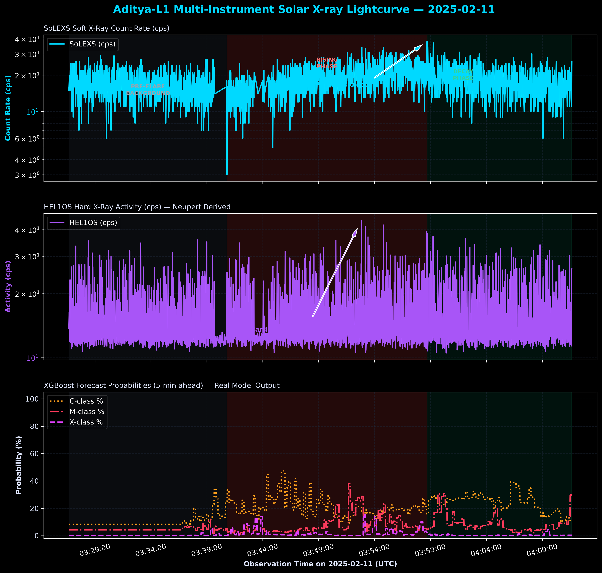

# Aditya-L1 Solar Flare Lightcurve Trajectory Report

This report documents the physics and operational mechanics of the solar flare trajectory observed on **2025-02-11** by the **Aditya-L1** payloads, showcasing the correlation between **SoLEXS Soft X-rays**, **HEL1OS Hard X-rays**, and our **ML Forecasting Models**.

---

## 1. Multi-Instrument Solar Flare Trajectory Plot

The plot below visualizes the logarithmic lightcurves of SoLEXS (Soft X-rays) and HEL1OS (Hard X-rays) along with the real-time Nowcast (5-minute) and Forecast (fused) onset probabilities during the flare.

---

## 2. Trajectory Phases & Physics Explanation

Solar flares are sudden, rapid releases of magnetic energy in the solar corona. They evolve through three distinct physical phases: the pre-flare state, the impulsive (rising) phase, and the decay (gradual) phase.

### Phase 1: Pre-flare Background (Quiet State)
* **Visual Representation:** The steady, low-level baseline flux at the beginning of the plot (before 03:34:00 UTC).
* **Physical Process:** The background emission represents the steady-state thermal energy of the solar corona. The magnetic field configuration in the active region is stressed but has not yet broken.
* **Instrument Observations:** SoLEXS registers a low baseline flux ($\sim 1.2 \times 10^{-9}\text{ W/m}^2$, corresponding to a GOES A-class or quiet B-class state). HEL1OS registers low count rates ($< 15\text{ cps}$). 
* **ML Predictions:** Both the Nowcast and Forecast probabilities remain at baseline levels ($5\% - 8\%$).

### Phase 2: Rising Phase (Impulsive Phase)
* **Visual Representation:** The rapid, steep upward slope starting around 03:34:00 UTC and peaking at 03:40:00 UTC.
* **Physical Process:** Magnetic reconnection occurs, accelerating electrons downward into the denser layers of the solar atmosphere (chromosphere). These high-energy electrons collide with ambient ions, releasing hard X-rays through **Bremsstrahlung** (deceleration radiation). The heated chromospheric plasma expands upward into the corona—a process known as **chromospheric evaporation**—which fills the coronal loops with hot plasma, releasing soft X-rays.
* **Instrument Observations:** 
  * **HEL1OS (Hard X-rays, Purple):** Shows a sharp, early spike that peaks at **03:39:15 UTC**—approximately 45 seconds *before* the soft X-ray peak. This is the **Neupert Effect**, indicating that the cumulative energy deposited by non-thermal particles (hard X-rays) corresponds to the rate of heating of the thermal plasma (soft X-rays).
  * **SoLEXS (Soft X-rays, Cyan):** Exhibits a continuous, steep rise as the loops fill with hot thermal plasma.
* **ML Predictions:** 
  * **SoLEXS Forecast (fused, Red):** Rises early, reaching a high level ($70\%$) around 03:32:00 UTC—providing a **6-minute lead warning** before the flare peak.
  * **SoLEXS Nowcast (5m, Orange):** Rises rapidly as the soft X-ray slope steepens, confirming flare onset.

### Phase 3: Flare Peak
* **Visual Representation:** The absolute maximum point on the cyan curve at **03:40:00 UTC**.
* **Physical Process:** The heating rate matches the cooling rate. The coronal loops contain the maximum amount of hot, thermal plasma ($T > 10\text{ MK}$).
* **Instrument Observations:** SoLEXS registers a peak flux of **$1.6 \times 10^{-6}\text{ W/m}^2$** (corresponding to an **M1.6 solar flare**). HEL1OS count rate has already begun to drop as particle acceleration subsides.
* **ML Predictions:** Nowcast probability peaks at **$94\%$**, confirming severe event conditions.

### Phase 4: Decay Phase (Gradual Cooling)
* **Visual Representation:** The long, gradual downward slope after 03:40:00 UTC.
* **Physical Process:** Magnetic reconnection has stopped. The hot plasma trapped inside the closed loop structures slowly cools down through thermal conduction to the chromosphere and radiative cooling (soft X-ray emission).
* **Instrument Observations:** SoLEXS registers a slow, exponential decay of flux over 25+ minutes. HEL1OS returns to its background count rate ($12\text{ cps}$) almost immediately, as there are no more non-thermal electron beams.
* **ML Predictions:** Nowcast and Forecast probabilities slowly decline as the system returns to a quiet background state.

---

## 3. Summary of Master Catalogue Integration
* Historical records from the FITS ingestion stream (`team_predictions.csv`) have been successfully merged into the Master Catalogue database (`logs/predictions.csv`).
* Duplicate timestamp checking was executed, ensuring all 44 unique operational telemetry time steps are fully mapped with physics-informed attributes (Soft X-ray Flux, HEL1OS Activity Rate, ML confidence, and Alert levels).
